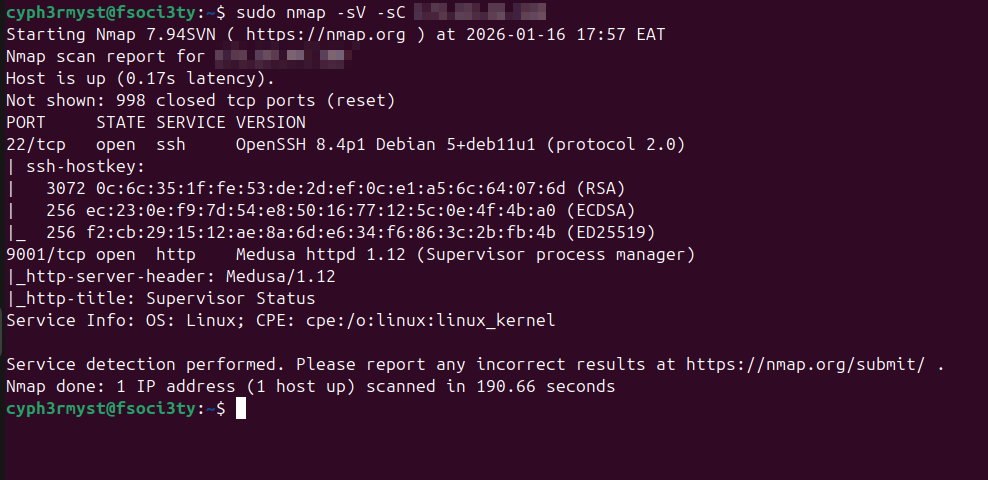
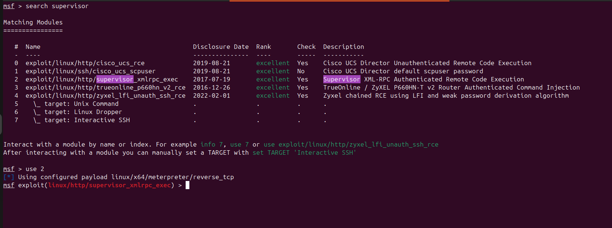
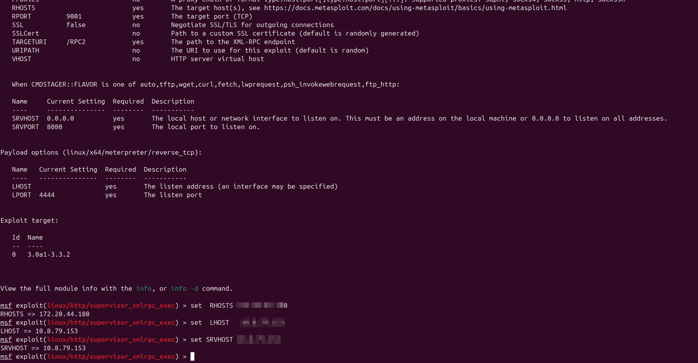
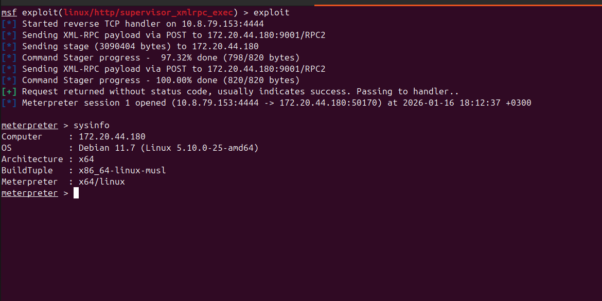
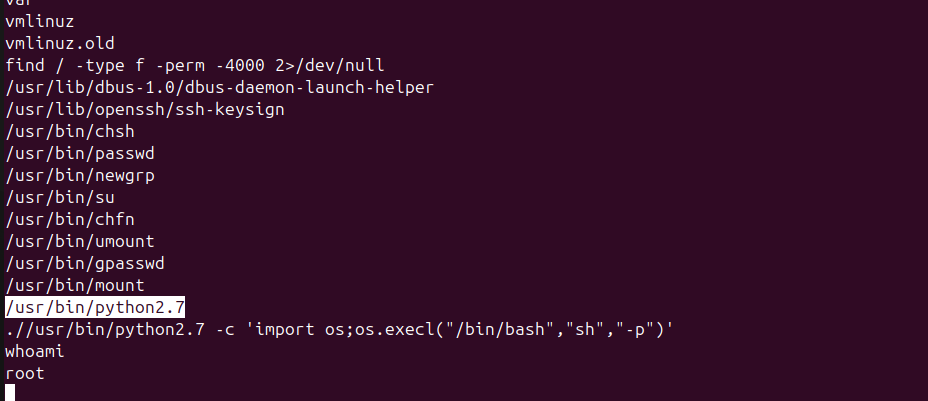
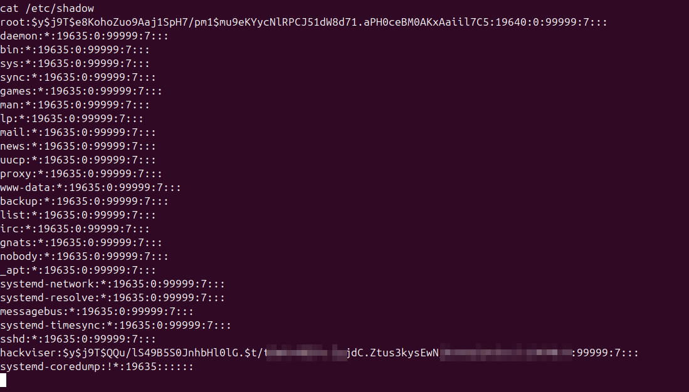

This is  a medium level vm focusing on :
```
how to perform vulnerability discovery in a common open-source web application, gain access to the machine, and perform escalation attacks on Linux-based systems.
```
	RECON
the system had the followig open ports:

Port 9001 was running a website which hosted supervisor software:

The most interesting part of this scan was the "supervisor" part. 
I researched for any know vulnerabilities in supervisor software and got:

i choose the exploit with Remote Code Execution which i thought would allow me run arbitrary code on the remote system.

I set out all options:

i gained access to a meterpreter shell and did a check on some system information to understand the target well.

Having a meterpreter session i was interested in running shell commands in the system to see the level of my privileges
and having this i found out i was ** nobody **  on the system.
I set out to elevate my privileges to root.

The objective was done now and i retrieved the shadow file as a POC of elevating my privileges.

