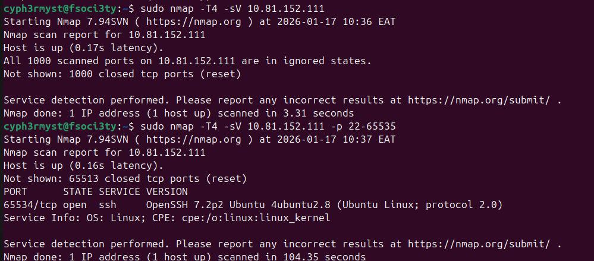
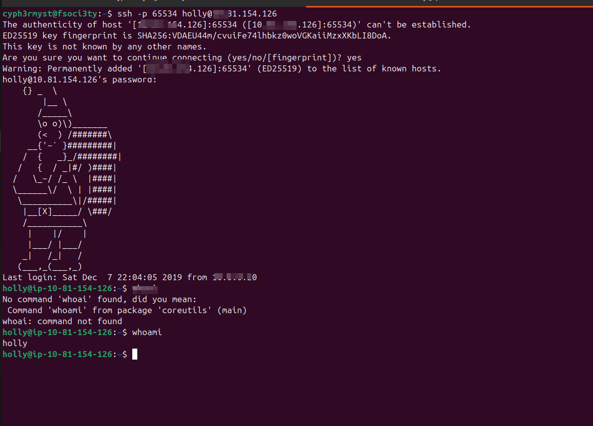
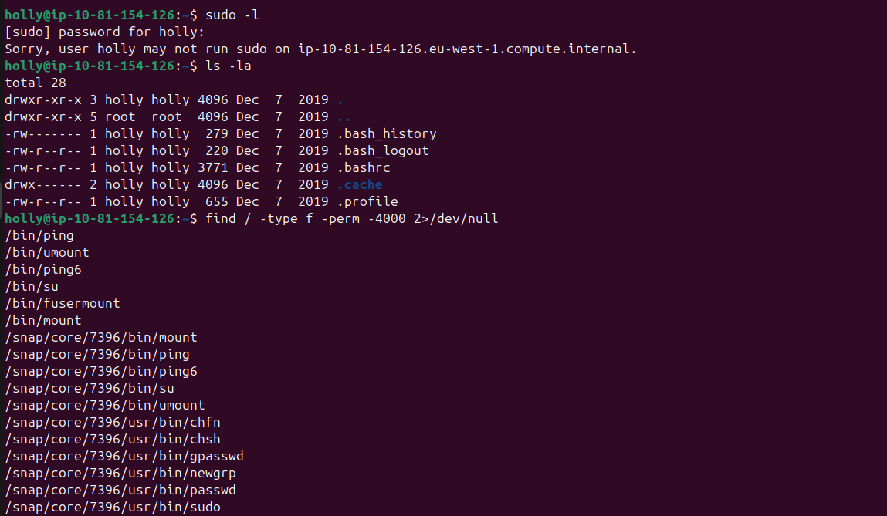
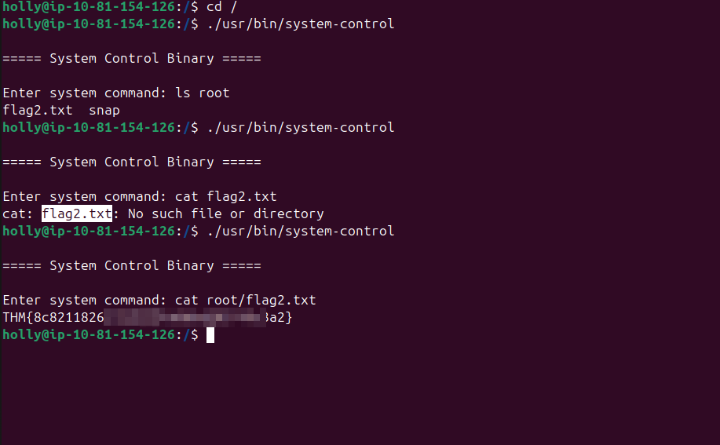
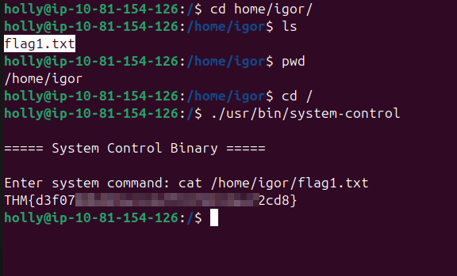

This was classic privilege escalation.
First this was abit challenging:

the first objective was to enumrate for open ports in the target system
NMAP results:

From the challene we were provided with the login credentials:

Deploy and SSH into the machine.
Username: holly
Password: tuD@4vt0G*TU

I run "whoami" on the system i found out i was **holly** , i tried to see wat commands i could be allowed to run as root and 
found out i could run nay commands as root 


Having this i knew i  the only way for me to retrieve all the two flags was by elevating my prileges to root

finding suid binaries of the system:

The binaries contained one binary which was :
```
/usr/bin/system-control

```
researching on this binary i found out that it could allow one to run root level commands on the system no matter the user level  permissions.
I manipulated the binary to list the contents of root directory 

and got the root flag.
Having the root flag i knew also the it would be easier to get the user flag too
The objective for user flag was to read the file in igor's directory and i navigated to it,but since i was logged in as holly i couldn't read the file so i 
used the bianary to read the user flag

Having done this all the objectives were accomplished.


