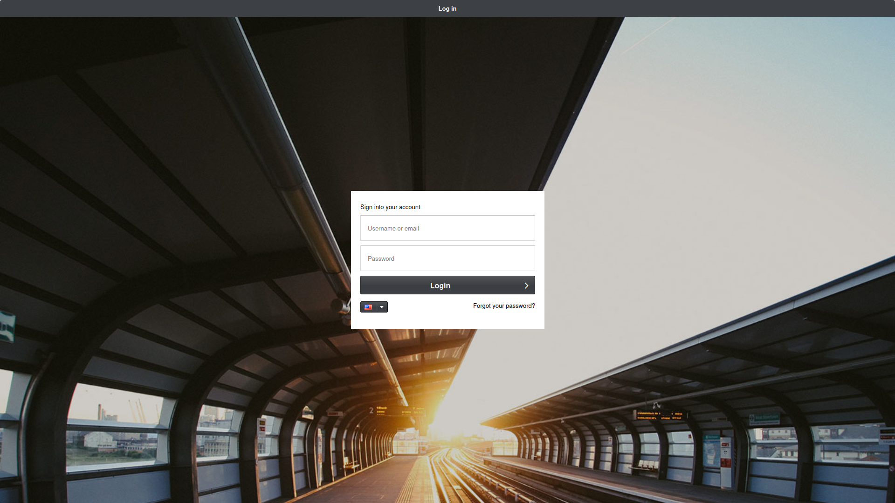
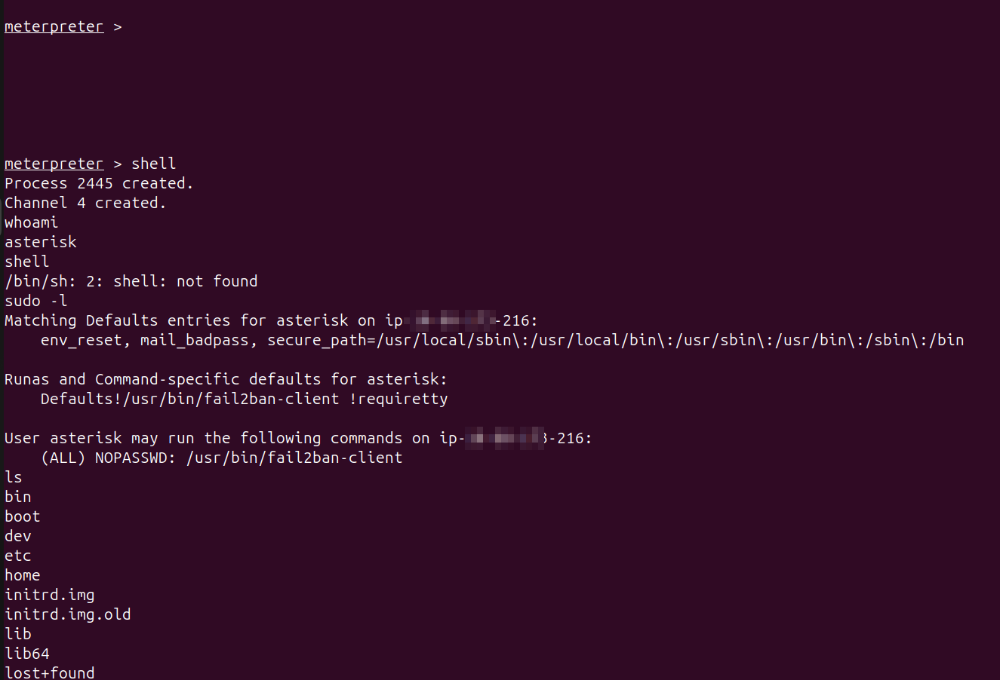

#after almost one year am back to this vm again in tryhackme,the last time i was stuck on gaining access to 
the system.'

RECON : 
22/tcp   open  ssh     OpenSSH 9.2p1 Debian 2+deb12u6 (protocol 2.0)
80/tcp   open  http    Apache httpd 2.4.62 ((Debian))
3306/tcp open  mysql   MariaDB (unauthorized)

Port 80 is running a login in a website 

What it is:

MagnusBilling is a powerful open-source VoIP billing system that lets you manage SIP trunks,
VoIP providers, DIDs, and call routing efficiently.
It's widely used by VoIP businesses, call centers, and service providers to automate billing, monitor call usage, and optimize traffic routes.

I researched for  some exploits and found this metasploit module:
	linux/http/magnusbilling_unauth_rce_cve_2023_30258
Running the exploit gave   a meterpreter shell :

Now having gained access the first thing was to check system information and run a shell on the system.
This gave a standard shell but the system didn't have a bash shell

