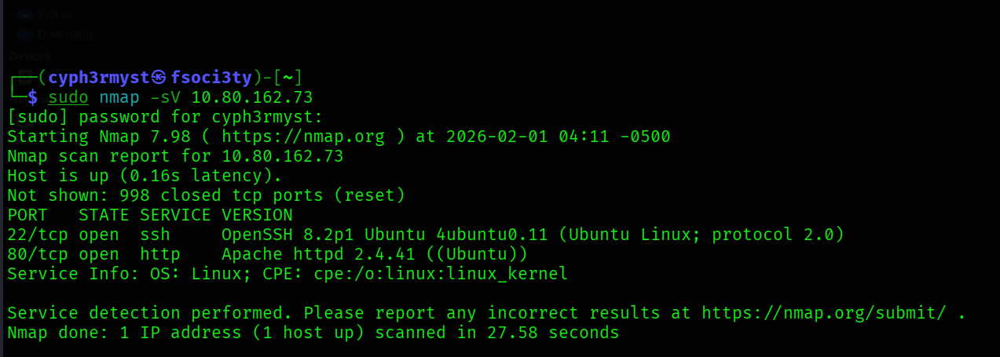
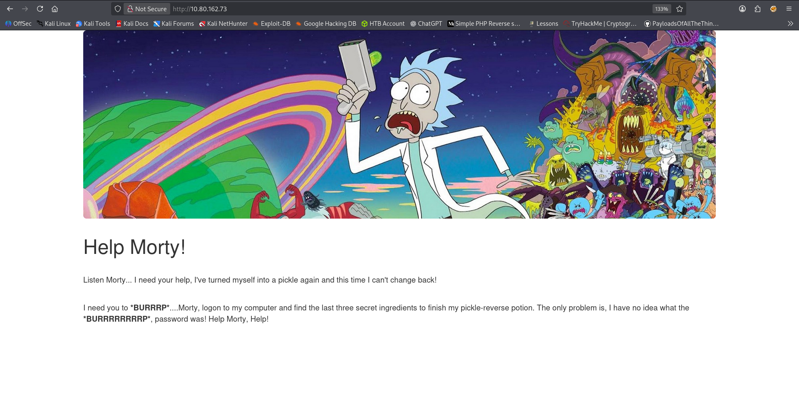
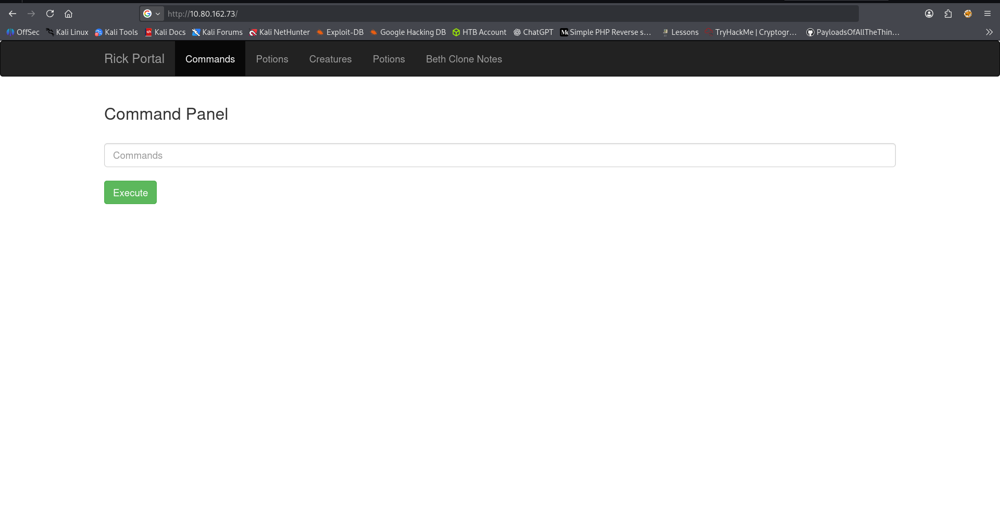
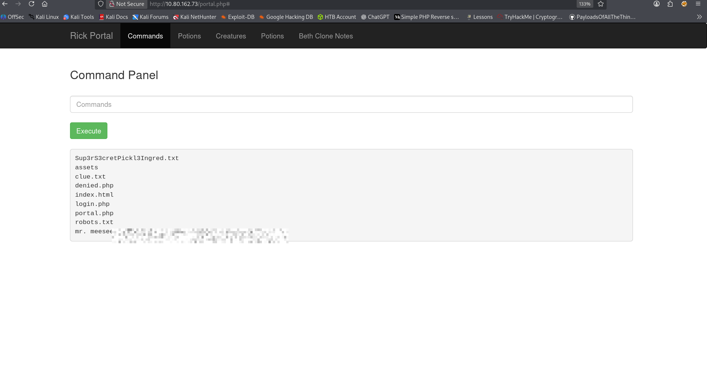
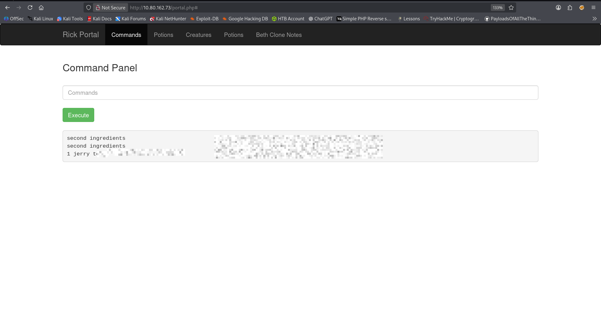
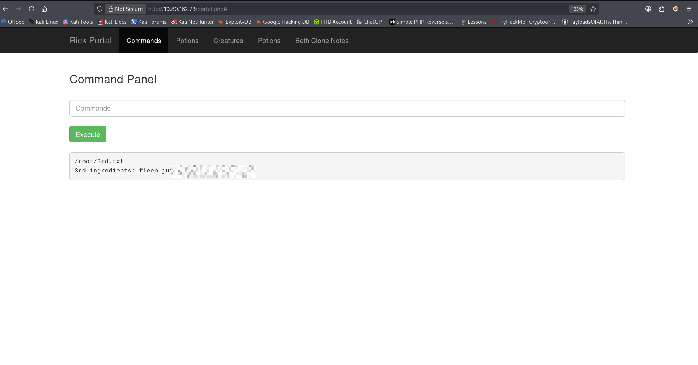

Date: 01/02/2026
Target OS: Ubuntu
	** RECON **
Open ports and running services:


The website running: 



Web enumeration:

Found the following open web directories which leaked the following info:


/robots.txt  contained a string which i later found out to be the password for the login

Wubbalubbadubdub

```sh

// a comment in the index.html source code
    Note to self, remember username!

    Username: R1ckRul3s
    
    Found passowrd:
	    Wubbalubbadubdub

```
Gained access through the leaked username and password from /robots.txt


clue.txt
Look around the file system for the other ingredient.

Sup3rS3cretPickl3Ingred.txt


Working command is: less
```sh
bin
boot
dev
etc
home
initrd.img
initrd.img.old
lib
lib64
lost+found
media
mnt
opt
proc
root
run
sbin
snap
srv
sys
tmp
usr
var
vmlinuz
vmlinuz.old
rick
ubuntu


```

Looking for the second ingredient,i suspected it could be in home user directory :


```sh
cd / ; cd home ; cd rick    ; cd "second ingredients" ; ls -la ; less "second ingredients"
```

Contents of second ingredient:


Finding the third ingredient

Trying to list Directory contents Recursively:

```sh
cd /;cd var ; ls -R
```

Using the find command to find the third ingredient:

```sh
sudo find / -type -f "*.txt"
```
Found :
*/root/3rd.txt*

Reading the contents of  *3rd.txt*

```sh
sudo find / -type f -name 3rd.txt ; sudo less /root/3rd.txt

```

