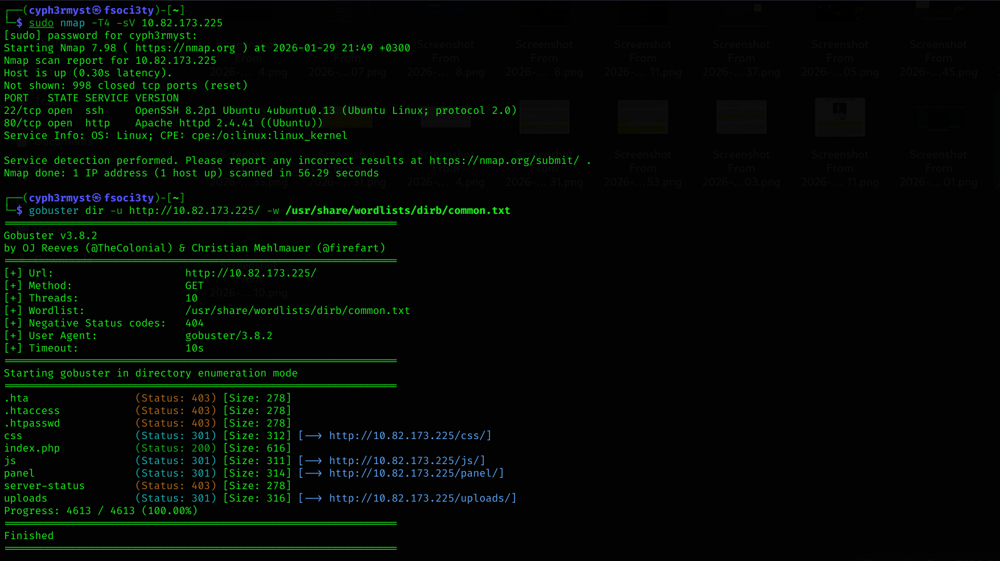
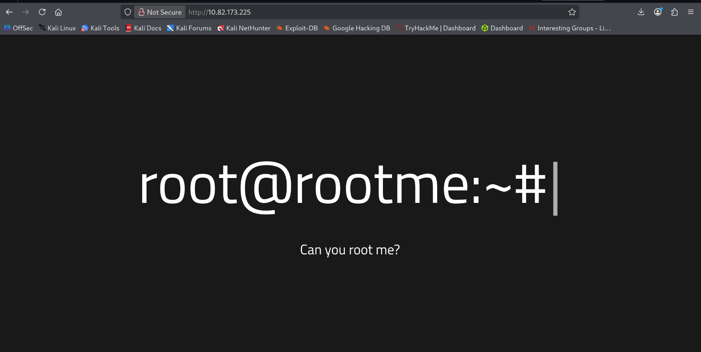
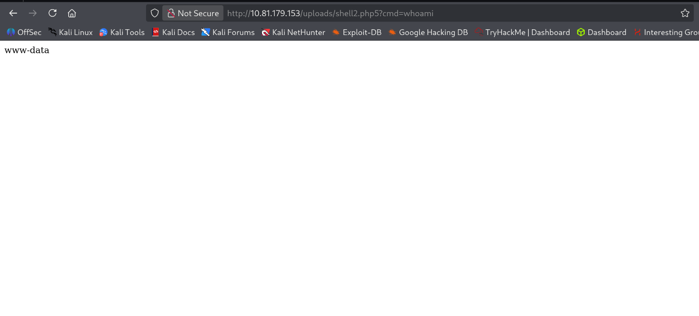
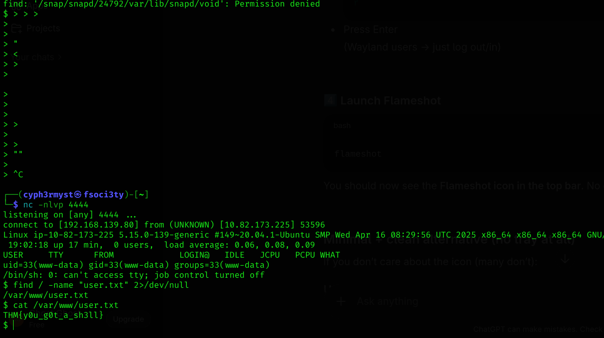
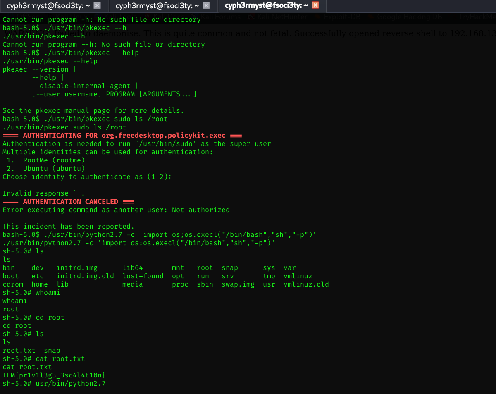

This was an easy to pwn site though the trick part was being able to upload the php payload without being detected.
	**Recon**
	Started with nmap recon to see what services were running on the target

Enumrating the website:

I tried to gather as much info about the site and found two directories:
/uploads/
/panel

Opening /panel allowed one to upload a file.First i upladed a .png image and it succeeded,trying to upload php would fail and hence i tried to upload a simple .php5 script which would allow 
Remote Code Excution on the site and it worked.

I went for a Reverse shell which i would try to use to do privilege escalation
Having uploaded the php reverse shell payload i went gather info on what i could do on the system and i had no permissions to run anything.Just reading userflag.txt

Finding binaries to perform privilege escalation,fount python2.7 and leveraged it to become **root**

LESSONS
- This shows the Vulnerabilties which exist when a site fails to filter all types of php files 
